# Проектування баз даних з використанням семантичних моделей

- перевести таблицю до такого стану, щоб вона відповідала вимогам першої, другої та третьої нормальної форм;
- створити ER-діаграму, що відображає взаємозв'язки між сутностями;
- створити таблиці в базі даних на основі ER-діаграми.

Опис завдання

1. Переведіть початкову таблицю в першу нормальну форму.
2. Переведіть нові таблиці в другу нормальну форму.
3. Переведіть нові таблиці в третю нормальну форму.
4. Розробіть ER-діаграму отриманих таблиць.

> 💡 Використовуйте зрозумілі та конкретні імена для сутностей та атрибутів. Уточнюйте типи даних для атрибутів.
> Перевірте, чи всі відношення й атрибути мають чіткі і зрозумілі кардинальності та значення.

5. Використовуючи ER-діаграму, створіть таблиці в базі даних. Оформіть ці таблиці без конкретних значень, тільки з урахуванням колонок та їхніх зв'язків, вручну або автоматично.

## Початкова таблиця

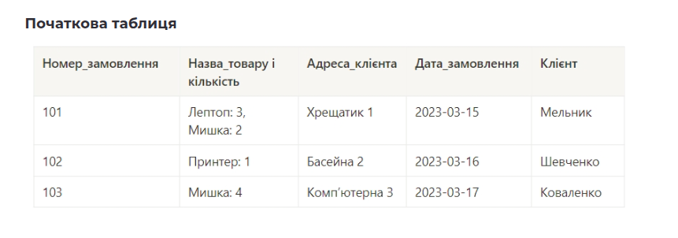

ця ж таблиця у EER Diagram

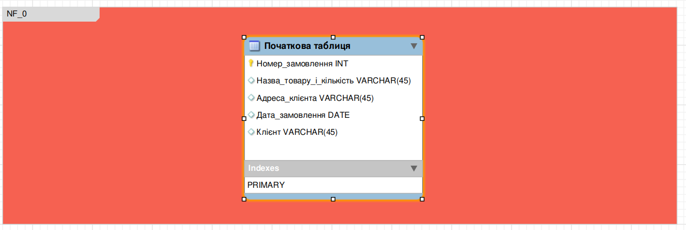

## Етапи виконання

#### 1. Переведіть початкову таблицю в першу нормальну форму.

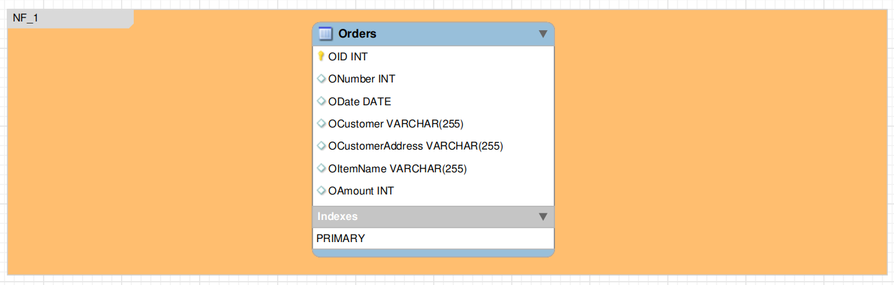

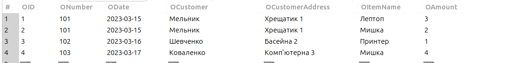

#### 2. Переведіть нові таблиці в другу нормальну форму.

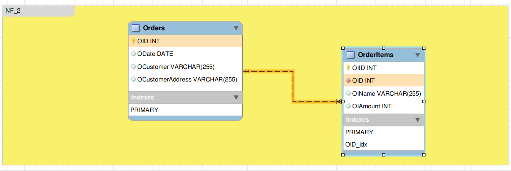

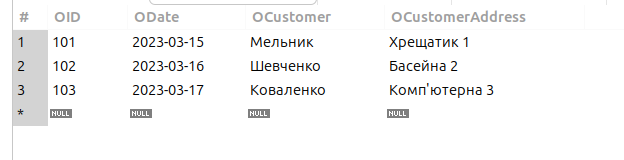

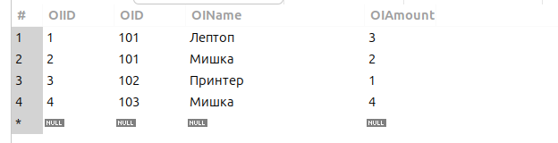

#### 3. Переведіть нові таблиці в третю нормальну форму.

**NF 3**

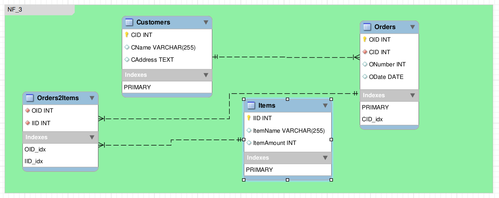

**Customers Table**

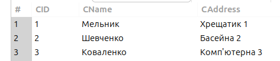

**Orders Table**

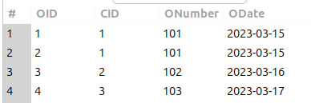

**Orders2Items**

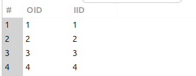

**Orders Items**

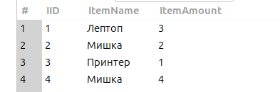

#### 4. Розробіть ER-діаграму отриманих таблиць.

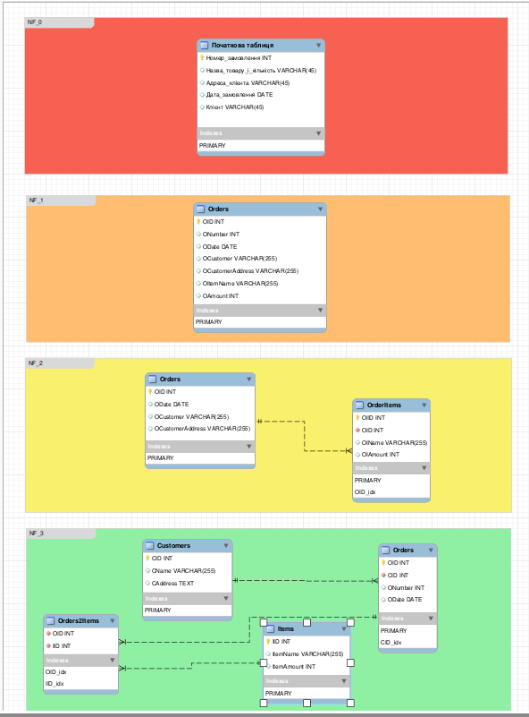

[Посилання на діаграму (goit-rdb-hw-02.mwb)](./goit-rdb-hw-02.mwb)

#### 5. Використовуючи `ER-діаграму`, створіть таблиці в базі даних. Оформіть ці таблиці без конкретних значень, тільки з урахуванням колонок та їхніх зв'язків, вручну або автоматично.

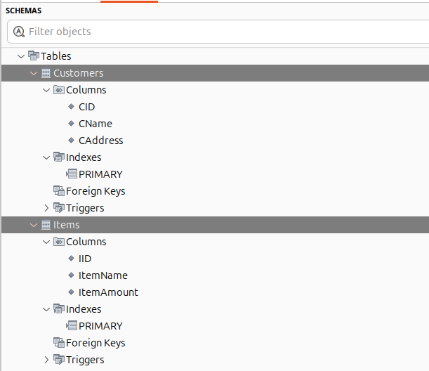

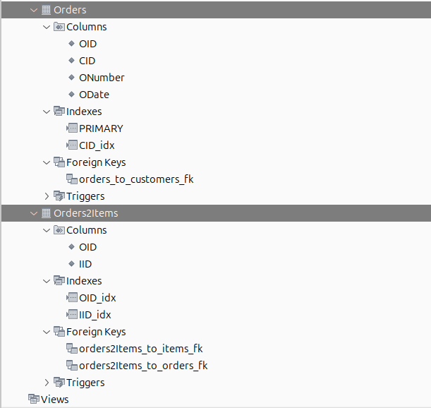

[Посилання на SQL файл для 3-ї форми (structure_and_data.sql)](./structure_and_data.sql)
